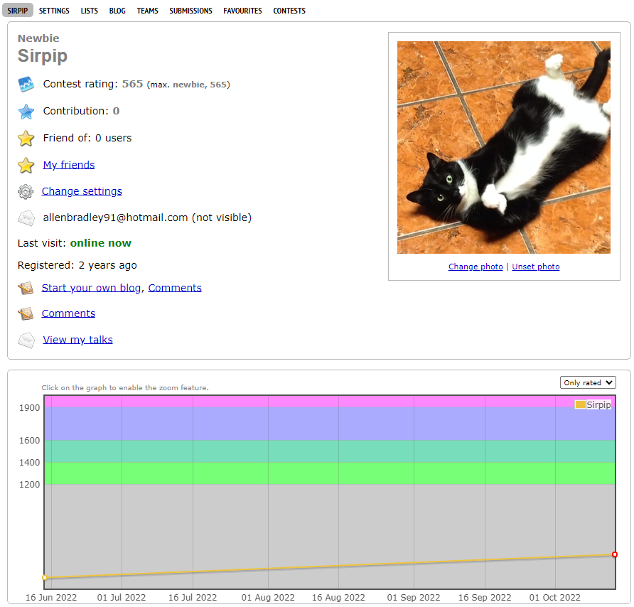

# Competitive Programming

Documenting Grey to Red

 

## Description

This repo will be used to keep track of problems and topics that I use in each rating to get me to the next.
I will have folders for each rating and inside each are topics and problems that where solved to get to the next rating.

## Goal
Goal of this repository is to leave nothing out of my journey and document every aspect of the improvement of my cpp.

### Weapon of choice: C++

* I will be using C++ to solve problems.
Ranking will be based on Codeforces.
Sites will include:
*Codeforces
*Codechef
*SPOJ
*any other site

https://codeforces.com/profile/Sirpip
